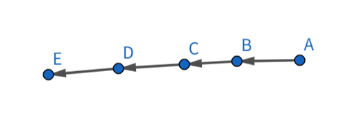
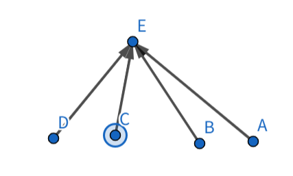

# 并查集

~~原来我之前写Kruscal没有写路径压缩和启发式合并吗，那真是史~~

想法很简单, 如其名
- 两个关键函数`find()`和`merge()`, 一个**查**, 一个**并**
- 只用根节点代表一个集合
- 一个重要数组`father[]`
  - `father[i]`, 表示 `i` 的父节点为 `father[i]`
  - **初始化**(别忘了) 所有节点的父节点为自己
  - 根节点`father[i] == i`
- 我们只需判断根节点是否一样即可知道两个节点是否在一个集合

---

## 优化

### 一、路径压缩

集合的深度越大搜索效率越低
甚至最极端的情况直接连成一个类似链表的结构

此时我们`find(A)`, 复杂度直接退化为$O(n)$

于是我们每次找到根节点都进行一次**压缩**, 直接把搜索的节点连接到根节点

**注意:不管搜索的元素深度为多少,`find()`结束后,这条路径上所有的节点都会被压缩到根节点(因为`find()`递归调用)**
比如我们对上图进行`find(A)`(已经进行压缩)



如果不进行`merge()`那么深度不会超过 2

代码
```cpp
int find(int a)
{
    if (a == father[a]) 
        return a;
    return father[a] = find(father[a]);//Compression
}
```

---

### 二、启发式合并

#### 2.1 按秩
就是`merge()`会比较集合的深度,把深度小的集合连接到深度大的集合,以减小集合深度

- 我们可以建立数组`rank[]`对集合的深度进行维护
- 只有当两个集合深度相同时`merge()`才会影响深度(`+1`)
- **初始化**(别忘了)所有深度为`1`

代码
```cpp
void merge(int s1, int s2)
{
    int f1 = find(s1);
    int f2 = find(s2);
    if (f1 == f2) return;
    //这里我们期望f1是更深的那棵树的根, 之后把f2并到f1上
    if (rank[f1] < rank[f2]) swap(f1, f2);
    father[f2] = f1
    if (rank[f1] == rank[f2]) rank[f1]++;
    return;
}
```
$
$
#### 2.2 按大小
另外其实更好用的是维护集合大小,我们开一个`size[]`

根本上是为了**减少深度**
但为什么用按`size`进行也能达到优化复杂度的效果呢？
`rank`和`size`有怎样的内在联系呢?

**推理：**
1. 初始状态：每个节点独立成树，大小为`1`
2. 第一次合并：一个大小为`1`的树被合并到一个至少大小为`1`的树中。合并后，这个节点所在的新树的大小至少是 `1 + 1 = 2`
3. 第二次合并：这个节点所在的树（大小至少为`2`）又被合并了。根据按大小合并的规则，它只会被合并到一个更大或相等的树中。所以，合并后新树的大小至少是 `2 + 2 = 4`
4. 第三次合并：大小至少为`4`的树被合并到一个至少为`4`的树中，新树大小至少为 `8`。
5. 以此类推……

对于任何一个节点，它所在树的大小随着合并次数的增长，至少是呈指数增长的：`1, 2, 4, 8, ...`, 直到 `n`。

从 `1` 增长到 `n`，这个增长过程最多能进行多少次？

答案就是 $\log_2(n)$ 次。因为 $2^k = n$ ，则 $k = \log_2(n)$

**这对树高意味着什么？**
一个节点从初始状态开始，最多会被合并 $O(log n)$ 次。每次合并，这个节点所在的整棵小树会被“挂”到大树下面

在最坏的情况下，这次合并可能会使该节点到根节点的路径长度增加`1`

由于一个节点最多被合并 $O(log n)$ 次，那么它到根节点的路径长度（也就是它在树中的深度）最多也只会增加 $O(log n)$ 次。

因此，按大小合并可以保证，任何节点的深度都不会超过 $O(log n)$

于是我们把单次操作优化到了$O(log n)$

代码
```cpp
void merge(int S1, int S2)
{
    int f1 = find(S1);
    int f2 = find(S2);
    if (f1 != f2)
    {
        if (size[f1] < size[f2])
        {
            swap(f1, f2);
        }
        father[f2] = f1;
        size[f1] += size[f2];
    }
}
```


---

当**启发式合并**与[**路径压缩**](#一路径压缩)优化结合使用时，并查集的效率会变得更高，平均操作时间接近常数，即 $O(\alpha(n))$，其中 $\alpha(n)$ 是增长极其缓慢的反阿克曼函数。

---

## 带权(路径长度)并查集

- 这里又可以来一个`dist[]`数组进行维护
- `dist[i]`表示`i`节点到`father[i]`的距离
- 由于带权了，所有边都多了一个参数`dist`,我们的`merge()`函数也要多传一个参数

应用与代码详见004
[洛谷P2294](https://www.luogu.com.cn/problem/P2294)

---

## 种类并查集

wait, 我还不会, 待更新

