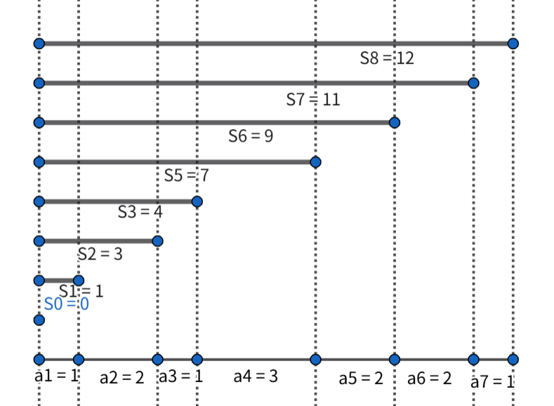

# 前缀和

~~哈哈在学这个之前我居然就用过这个思想解决问题了,我是小(大)天(ba)才(ka)~~

可简单理解为数列前n项和

---

## 一维前缀和

**为什么用前缀和？**
比如在数组 `a[n]` 中我们 需要求`m`次某段区间所有`a[i]`的和, 这时我们的复杂度来到了 $O(mn)$ ,但我们实际上可以以前缀和`S[n]`的形式来存这个数组

$S_n = \sum_{i=1}^{n} a_i$

这时我们求 $[l,r]$ 区间和 只需`S[r] - S[l - 1]`,单次操作复杂度来到了 $O(1)$

还可以形象理解: `a[i]`存的是相邻点的线段长度, 而`S[i]`存的是点坐标



代码(一般在输入阶段就做好前缀和的储存)~~这么简单真的要板子嘛~~
```cpp
void prefix_sum()
{
    S = a;
    // std::partial_sum(a.begin(), a.end(), S.begin());
    for (int i = 1; i <= n; ++i)
        S[i] += S[i - 1];
}


int query(int l, int r) 
{
    return ps[r] - ps[l - 1];
}
```

## 二维前缀和

